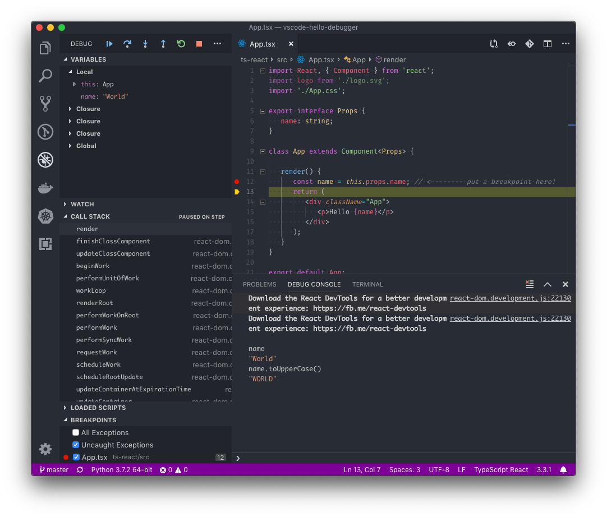

# vscode-hello-debugger

Practicing vscode debugging with various languages.

Each top-level folder includes a simple hello world program that is intended to be debugged.

Debug configurations for these projects are defined inside `.vscode/launch.json`

## Language/Project Examples

* TypeScript
  * [Node](./ts-node/README.md)
  * [Client Side](./ts-react/README.md) (shown with a simple `create-react-app` project)
* [Python](./python/README.md)
